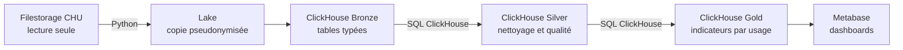

# Partie 1 - Interface d'analyse

Ce document est complété progressivement avec les choix réellement implémentés dans le
projet. Il constituera le dossier accompagnant les dashboards Metabase.

## 1. Besoin

Le CHU reçoit chaque jour des données provenant de plusieurs systèmes et dans plusieurs
formats. Le projet doit les centraliser, les fiabiliser et les restituer pour deux usages :

- le pilotage hospitalier : activité des services et qualité des soins ;
- la recherche clinique : constitution et description de cohortes.

La solution doit être incrémentale, rejouable et traçable. Elle doit également empêcher
l'entrée de données directement identifiantes dans l'entrepôt et séparer les accès des
deux publics.

## 2. Sources

Le filestorage fourni est considéré comme une source externe en lecture seule.

| Source | Format | Contenu utile |
|---|---|---|
| Patients | CSV | Identité source, naissance, sexe et région |
| Séjours | CSV | Patient, service, admission, sortie et modes de prise en charge |
| Diagnostics | JSON imbriqué | Codes CIM-10 et types de diagnostic par séjour |
| Monitoring | Parquet | Horodatage, fréquence cardiaque, SpO2 et température |
| Services | CSV | Référentiel des services |
| CIM-10 | CSV | Référentiel des diagnostics |

Les identifiants directs présents dans les fichiers patients sont nécessaires uniquement
à l'entrée du pipeline. Ils ne sont pas conservés dans le lake ni dans ClickHouse.

## 3. Architecture et justification

Choix retenus :

- le filestorage est monté en lecture seule afin de ne jamais modifier les dépôts du CHU ;
- Python copie les fichiers, applique la pseudonymisation obligatoire et pilotera les
  chargements et les requêtes ;
- ClickHouse exécutera les transformations Bronze vers Silver puis Gold en SQL ;
- aucune transformation métier ne sera réalisée en mémoire avec pandas ;
- Metabase fournira les interfaces d'analyse sans développement d'une application web.

Cette séparation permet au monitoring Parquet d'être traité par lots sans sortir les
données de ClickHouse lors des futurs nettoyages et agrégations.

## 4. Traitements

### 4.1 Traitement actuellement implémenté : entrée du lake

Le premier traitement fonctionnel réalise uniquement la copie et la protection des
identifiants. Il ne nettoie pas encore les données métier.

| Source | Traitement appliqué |
|---|---|
| Patients | HMAC-SHA-256 de `patient_id`, conservation de l'année de naissance, suppression du NIR, du nom et du prénom |
| Séjours | HMAC-SHA-256 de `stay_id` et `patient_id` avec des secrets distincts |
| Diagnostics | Remplacement de `stay_id` par `stay_sk`, sans modifier les diagnostics imbriqués |
| Monitoring | Remplacement de `stay_id` par `stay_sk`, lecture et écriture Parquet par lots de 10 000 lignes |
| Référentiels | Copie identique des fichiers CSV |

Les pseudonymes sont déterministes : un même identifiant produit la même clé dans les
différents fichiers et permet donc les futures jointures. Les secrets restent en dehors
du dépôt Git.

Le traitement a été validé sur les 14 fichiers fournis. Les sorties ne contiennent plus
les colonnes directement identifiantes et les pseudonymes sont cohérents entre les
séjours, les diagnostics et le monitoring.

### 4.2 Chargement Bronze actuellement implémenté

ClickHouse lit directement les fichiers pseudonymisés avec la fonction SQL `file()`.
Python se limite à découvrir les fichiers, calculer leur checksum et envoyer les requêtes
SQL. Les lignes ne sont pas chargées dans une structure pandas.

| Table Bronze | Contenu |
|---|---|
| `bronze.patients` | snapshots patients pseudonymisés |
| `bronze.stays` | séjours avec dates et modes conservés comme valeurs brutes |
| `bronze.stay_diagnoses` | diagnostics aplatis par `ARRAY JOIN` dans ClickHouse |
| `bronze.monitoring` | constantes typées lues directement depuis Parquet |
| `bronze.services` | référentiel des services |
| `bronze.cim10` | référentiel des diagnostics |

Chaque ligne contient le jour source, le chemin du fichier, son checksum, un identifiant
de lot et l'horodatage de chargement. La table `control.ingested_files` empêche de charger
deux fois un fichier ayant le même chemin et le même contenu.

Les dates de séjour restent en texte dans Bronze. Cette décision permet de conserver une
ligne mal formée jusqu'aux contrôles Silver au lieu de faire échouer l'ensemble du lot.

Le test de chargement a enregistré 14 fichiers au statut `SUCCESS` et 135 275 lignes
Bronze. Un rejeu identique a ignoré les 14 fichiers sans modifier les volumes. Le schéma
Bronze ne contient aucune colonne directement identifiante.

### 4.3 Traitements à venir

- contrôles qualité, déduplication et cohérence des jointures dans Silver ;
- calcul des indicateurs dans Gold ;
- planification, journalisation, traçabilité et reprise sur incident.

## 5. Indicateurs attendus

Les indicateurs viennent du besoin métier. Ils seront documentés avec leur requête et
leur résultat uniquement après la construction de Gold.

### Pilotage hospitalier

- durée moyenne de séjour par service ;
- activité des urgences par jour ;
- taux de réadmission à 30 jours ;
- relevés de constantes en alerte par jour.

### Recherche clinique

- taille des cohortes par diagnostic ;
- distribution d'une cohorte par âge et sexe ;
- masquage des groupes de moins de cinq patients.

## 6. Visualisations attendues

Deux dashboards Metabase seront construits après validation des vues Gold :

- un dashboard Pilotage hospitalier ;
- un dashboard Recherche clinique.

Le cloisonnement sera démontré avec des droits ClickHouse et Metabase distincts. Aucune
visualisation n'est annoncée comme terminée à cette étape.

## 7. Limites et recommandations actuelles

- le lake réécrit un fichier existant sous le même chemin et ne conserve pas encore ses
  anciennes versions ;
- aucun contrôle de qualité métier n'est encore appliqué ;
- aucune donnée n'est encore disponible dans Silver ou Gold ;
- les seuils d'alerte du monitoring seront appliqués plus tard en SQL selon les bornes
  données dans le sujet ;
- les règles et chiffres finaux devront rester justifiables par leur fichier source et
  leur date de traitement.
